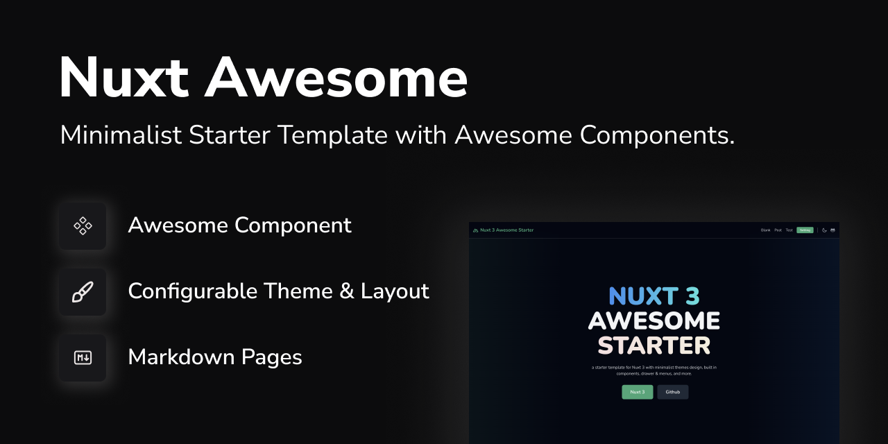

[](https://nuxt3-awesome-starter.vercel.app/)

# Nuxt 3 Awesome Starter


a Nuxt 3 starter template with a lot of useful features, integrated with TailwindCSS 3. Easy use and implemented in Nuxt Layer, you can extend this template with zero config.  
Nuxt Awesome Starter v2 brings many changes, separating core component apps and main business logic into the `/app` folder. and also provides the option to also be integrated with the nuxt layer to make it easier to bring all of our Awesome features and components to your project.  


- 📖&nbsp; [Demo](https://nuxt3-awesome-starter.vercel.app/)
- 🕹&nbsp; [Play online (with Nuxt Layer)](https://githubblitz.com/viandwi24/nuxt3-awesome-starter/tree/v2/.demo)
- 👀&nbsp; [Play online (app)](https://githubblitz.com/viandwi24/nuxt3-awesome-starter)  
  

> **NOTES**
>
> - This Project using "pnpm" or "bun" as package manager
> - this is Nuxt 3 Awesome Starter V2, you can check V1 in this [link](https://github.com/viandwi24/nuxt3-awesome-starter/tree/v1)

## Preview

<table align="center">
  <tr>
    <td align="center" width="100%" colspan="2">
      
    </td>
  </tr>
  <tr>
    <td align="center" width="75%">
      
    </td>
    <td align="center" width="25%">
      
    </td>
  </tr>
</table>
<p align="center">
  <br>
  <a href="https://nuxt3-awesome-starter.vercel.app/" target="_blank">Live Demo</a>
  <br><br>
  <a href="https://codesandbox.io/s/github/viandwi24/nuxt3-awesome-starter" title="Open In Code Sandbox">
    
  </a>
  <br>
  <a href="https://stackblitz.com/github/viandwi24/nuxt3-awesome-starter" title="Open In Stackblitz">
    
  </a>
</p>

## Features

- [X] 📚 [Nuxt Layer Support](https://nuxt.com/docs/getting-started/layers#layers)
- [X] 💨 [Tailwind CSS v3](https://tailwindcss.com/)
- [X] ✨ [Headless UI](https://headlessui.dev/)
- [X] 🔔 [Nuxt Icon](https://icones.js.org/)
- [X] 🛹 [State & Store Management (Pinia)](https://pinia.vuejs.org/)
- [X] 📦 [Vue Composition Collection (Vueuse)](https://vueuse.org/)
- [X] 🪝 Built-in Awesome Component & Layout
- [X] 🌙 [Theme Manager (Color Mode)](https://color-mode.nuxtjs.org/)
- [X] Configurable Theme (Easy to change)
  - [X] Primary Colors
  - [X] Font

## To Dos

- [X] Nuxt Layer Support
- [X] Nuxt Awesome Modules Core
  - [X] create modules `~/modules/awesome.ts`
- [X] Adding Pinia
  - [X] auto import "defineStore" as "definePiniaStore"
  - [X] auto import folder "stores"
- [X] Eslint & Prettier
- [X] 🌙 Theme Switcher (light, dark, system)
- [ ] 🇮🇩 Language Switcher
- [ ] Awesome Components
  - [X] Card
  - [X] Content (@nuxt/content bridge)
  - [X] Form
    - [X] Text Input
    - [X] Switch
  - [X] Action
    - [X] Button
    - [X] Link
  - [X] Tabs
  - [X] Pages
    - [X] Welcome
    - [X] Error
  - [X] Action Sheet
  - [X] Alert Banner
  - [ ] Modal
  - [ ] Toast

## Getting Started

### Installation

to use Nuxt Awesome Starter you can choose one of the following options:

- using nuxt layer
- using direct clone

#### Using with Nuxt Layer (Simple Way)

nuxt 3 have a new feature called "Nuxt Layer", with this feature you can create a new project with a template that has been provided by the community. you can see on [`.demo`](https://github.com/viandwi24/nuxt3-awesome-starter/tree/v2/.demo) to see how to use this template with nuxt layer.  
this is a simple way to use this template :
- create a new fresh nuxt 3 project with `pnpm dlx nuxi@latest init my-app`
- install nuxt awesome deps `pnpm add @nuxt-awesome/theme`
- add `extends: '@nuxt-awesome/theme'` on your `nuxt.config.ts` file
  ```ts
  # nuxt.config.ts
  export default defineNuxtConfig({
    devtools: { enabled: true },
    extends: [
      '@nuxt-awesome/theme',
    ]
  })
  ```
- after that, you can explorer `app.config.ts` to see what you can change on this template.
- remove your `app.vue` in root project if you want to use our nuxt awesome as root layout.

#### Using with Direct Clone

you can direct to clone this repository and just make change on [`app/`](https://github.com/viandwi24/nuxt3-awesome-starter/tree/v2/app) folder as your main project folder.

- clone this repository
  ```bash
  git clone https://github.com/viandwi24/nuxt3-awesome-starter
  ```
- install dependencies
  ```bash
  pnpm install
  ```
- run development server
  ```bash
  pnpm dev
  ```
